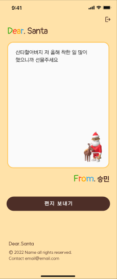
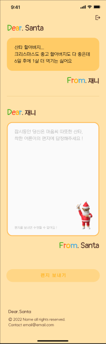

# 🎅 Dear Santa

크리스마스를 맞이해 각자의 고민거리를 산타에게 보내 익명의 산타의 답장을 받아보는 감성형 웹 애플리케이션입니다!

---

## 🔧 사용 기술

- **Frontend**: HTML, CSS, JavaScript(Vanilla)
- **Backend**: Django
- **인증**: JWT 기반 토큰 인증
- **협업 툴**: Figma, GitHub, Notion

---

## 🚀 주요 기능

- 간단한 회원가입 후 산타에게 보내는 편지 텍스트를 작성합니다.
- 익명의 상대방이 작성한 편지에 자기 자신이 익명의 산타가 되어 답글을 작성합니다
- 크리스마스가 되어 재접속 하게 되면 보낸 편지에 대한 답글을 볼 수 있게 됩니다.

---

## 📷 편지 작성 및 답장

| 편지 작성 | 편지 답장 |
|-----------|-----------|
|  |  |

---

## 👩‍💻 담당 역할

- 프론트엔드 담당. Figma 의 구현부에 맞게끔 프론트 구현 및 애니메이션 구현
- JWT를 활용해 프론트엔드-백엔드 간의 데이터 처리 및 사용자 인증 구현 
- GitHub 레포 관리 및 Notion 문서 작성

---

## 📝 회고

> JWT를 기반으로 한 사용자 인증 기능을 구현해보며 토큰 기반 인증 구조의 플로우를 체감할 수 있었고,
> **프론트-백 간 데이터 흐름**에 대한 보다 높은 이해와 관심, 사용자 위주의 접근중요성, 개발 자신감을 키웠던
> 프로젝트입니다.

---

## 🏅수상
 - 2022y 연합동아리 '멋쟁이사자처럼' 단풍톤 최우수상 수상 
